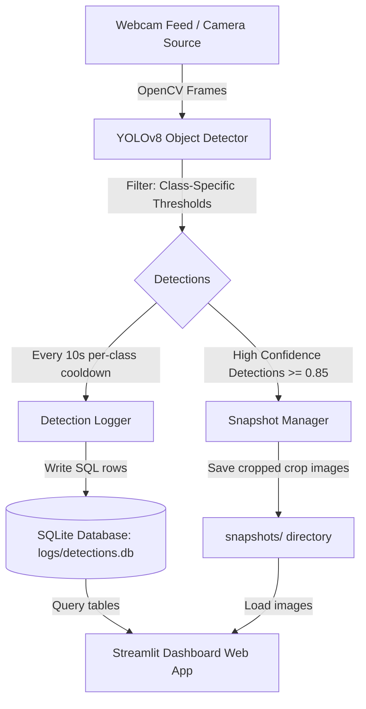

# 🖥️ Workspace Monitoring System using YOLOv8

An end-to-end, real-time object detection and workplace analytics system. It uses a webcam feed to monitor workspace occupancy and object utilization (detecting **people, laptops, cell phones, notebooks, and cups**), logs detection events dynamically to an SQLite database, saves high-confidence image snapshots, and visualizes live occupancy metrics on an interactive Streamlit dashboard.

---

## 🏗️ System Architecture

The Workspace Monitoring System follows a modular pipeline designed for low-latency CPU inference, automatic persistence, and real-time visualization.



---

## 🚀 Key Features

*   **Real-time Object Detection**: Monitors your desk or workspace for five classes: `person`, `laptop`, `phone`, `notebook`, and `cup`.
*   **Optimal CPU Inference**: Runs at ~5–6 FPS on a standard laptop CPU using the ultra-lightweight `yolov8n.pt` backbone.
*   **Intelligent Logging**: Persists detection events with timestamps and bounding box coordinates into an SQLite database (`logs/detections.db`) with a 10-second cooldown per class to avoid spamming the log.
*   **Automatic Snapshot Capture**: Automatically crops and saves high-confidence detections (`>= 85%` confidence) to a dedicated `snapshots/` folder.
*   **Web Dashboard**: Streamlit-powered dashboard that auto-refreshes every 5 seconds to show:
    *   Total detection stats & active class counts.
    *   Class-wise bar chart distributions.
    *   Tabular logs of recent detections.
    *   A grid gallery displaying the latest snapshots.
*   **Flexible Configurations**: Centralized YAML settings for camera resolution, database paths, and confidence thresholds.

---

## 📂 Project Directory Structure

```directory
yolo-detection-system/
├── config/
│   └── config.yaml           # Centralized configuration (thresholds, DB path, webcam)
├── dashboard/
│   └── app.py                # Streamlit dashboard application
├── src/
│   ├── __init__.py           # Package initialization
│   ├── collect_data.py       # Webcam-based custom dataset collection tool
│   ├── verify_dataset.py     # Train/Val/Test dataset count verification utility
│   ├── train.py              # Script to train YOLOv8 model on custom dataset
│   ├── explore.py            # Basic YOLO API playground & output explorer
│   ├── test_realworld.py     # Quick visual tester for the trained model on live webcam
│   ├── detect.py             # Main pipeline orchestrator (Webcam capture + log + snapshot)
│   ├── logger.py             # SQLite database logger wrapper
│   └── snapshots.py          # Auto-crop snapshot saver utility
├── data/
│   └── splits/
│       └── data.yaml         # Dataset configuration file (paths, class names)
├── logs/
│   └── detections.db         # Auto-generated SQLite database
├── models/
│   └── weights/
│       ├── best_v1_map853.pt # Trained weights from Run v1 (mAP@0.5: 0.853)
│       └── best_v2_map863.pt # Trained weights from Run v2 (mAP@0.5: 0.863)
├── assets/                   # Bounding box previews & static visual files
├── runs/                     # Ultralytics train/val training run outputs
├── NOTES.md                  # Comprehensive model evaluation and training logs
├── PROJECT_PROPOSAL.md       # Project scope, requirements, and timeline
├── requirements.txt          # Python project dependencies
└── README.md                 # Project user guide (this file)
```

---

## ⚙️ Configuration File Guide

All options are controlled inside [config/config.yaml](config/config.yaml):

```yaml
model:
  weights_path: models/weights/best_v2_map863.pt  # Path to model weights
  confidence_threshold: 0.25                    # Global detection threshold
  nms_threshold: 0.45                           # Non-maximum suppression threshold
  image_size: 640                               # Model inference resolution
  device: cpu                                   # 'cpu' or 'cuda' for GPU execution

camera:
  source: 0                                     # Webcam index (usually 0 for built-in camera)
  width: 1280                                   # Capture width
  height: 720                                   # Capture height

logging:
  database_path: logs/detections.db             # Path to SQLite DB
  snapshot_dir: snapshots/                      # Folder to store snapshots
  snapshot_confidence_threshold: 0.85           # Save crop if confidence >= 85%
  enable_snapshots: true                        # Enable automatic snapshotting

# Note: The alerts configuration below is a placeholder for future implementation
alerts:
  enable_desktop_notifications: false           # Desktop alert toggling (Reserved)
  alert_confidence_threshold: 0.85
  cooldown_seconds: 10                          # Cooldown window
```

---

## 🛠️ Installation & Setup

Follow these steps to run the application locally:

### 1. Prerequisite Checklist
*   Python 3.10 installed on your system.
*   A connected webcam or camera source.

### 2. Setup Virtual Environment
Clone this repository and initialize a clean Python virtual environment:
```bash
# Navigate to the repository root
cd yolo-detection-system

# Create virtual environment
python -m venv venv

# Activate virtual environment
# On Windows (PowerShell):
.\venv\Scripts\Activate.ps1
# On macOS/Linux:
source venv/bin/activate
```

### 3. Install Dependencies
Install all required libraries including OpenCV, PyTorch, Ultralytics, and Streamlit:
```bash
pip install -r requirements.txt
```

---

## 🚀 Execution & Usage Guide

### Step 1: Run Real-time Detection Pipeline
Execute the main script [src/detect.py](src/detect.py) to launch the webcam stream. The detector applies class-specific confidence thresholds, overlays bounding boxes, logs event records to SQLite, and outputs high-confidence snapshots.
```bash
python src/detect.py
```
*   **Webcam Window Controls**: Press **`q`** to close the camera stream and shut down the pipeline gracefully.

### Step 2: Launch the Analytics Dashboard
Open a separate terminal window, activate the virtual environment, and run the Streamlit dashboard app [dashboard/app.py](dashboard/app.py):
```bash
streamlit run dashboard/app.py
```
*   The dashboard will automatically open in your web browser (usually at `http://localhost:8501`).
*   It automatically polls and refreshes its charts and lists every **5 seconds**.

---

## 📁 Development Utilities

The repository contains several helper scripts designed to assist during the development lifecycle:

1.  **Custom Data Collection**: [src/collect_data.py](src/collect_data.py) allows you to capture images directly from your webcam to expand your training set.
    ```bash
    python src/collect_data.py --class_name notebook --target 300
    ```
    *   *Controls*: Press **`SPACE`** to save the current frame. Press **`q`** to exit.
2.  **Dataset Verification**: [src/verify_dataset.py](src/verify_dataset.py) scans your dataset folder structure and checks if your images match your labels.
    ```bash
    python src/verify_dataset.py
    ```
3.  **Train model**: [src/train.py](src/train.py) trains YOLOv8 on your custom dataset splits.
    ```bash
    python src/train.py
    ```
4.  **CLI Database Log Viewer**: [src/view_logs.py](src/view_logs.py) displays the latest 20 database entries in your terminal.
    ```bash
    python src/view_logs.py
    ```
5.  **Output Explorer**: [src/explore.py](src/explore.py) runs basic inference on a single static test image and prints out raw coordinate formats and confidence scores.
    ```bash
    python src/explore.py
    ```

---

## 📊 Model Performance History

The system model was trained and iterated over multiple stages. Full evaluation details are documented in [NOTES.md](NOTES.md).

### Comparison: Training Run v1 vs. Run v2

| Evaluation Metric | Run v1 (weights/best_v1_map853.pt) | Run v2 (weights/best_v2_map863.pt) | Change |
| :--- | :---: | :---: | :---: |
| **Epochs Trained** | 30 Epochs | 20 Epochs | -10 Epochs |
| **Precision** | 0.863 | 0.892 | **+0.029** |
| **Recall** | 0.788 | 0.810 | **+0.022** |
| **mAP @ 0.5** | 0.853 | 0.863 | **+0.010** |
| **mAP @ 0.5:0.95** | 0.602 | 0.629 | **+0.027** |

### Per-Class Metrics (Run v2)

| Class | Precision | Recall | mAP@0.5 | Performance Assessment |
| :--- | :---: | :---: | :---: | :--- |
| 🥛 **cup** | 0.968 | 0.930 | 0.959 | Excellent |
| 💻 **laptop** | 0.853 | 0.647 | 0.758 | Improved |
| 📓 **notebook** | 0.922 | 0.931 | 0.958 | Excellent |
| 👤 **person** | 0.773 | 0.631 | 0.682 | Challenging (needs additional data) |
| 📱 **phone** | 0.945 | 0.912 | 0.958 | Excellent |

---

## 🧠 Class-Specific Confidence Thresholds

To maximize real-world precision and minimize false alerts, the detector applies tailored confidence thresholds rather than a generic flat-rate cut-off:
*   **Cup**: `0.60`
*   **Laptop**: `0.70`
*   **Notebook**: `0.60`
*   **Person**: `0.35` *(lower threshold to compensate for small scale and occlusion)*
*   **Phone**: `0.70`

---

## 🔮 Future Improvements

1.  **Desktop Alerts Integration**: Implement the desktop alert notifications module (e.g. via `plyer` or standard Windows notifications) utilizing the parameters in the config file.
2.  **Edge Hardware Deployment**: Porting the pipeline to a NVIDIA Jetson Nano or Raspberry Pi 4 for localized edge analytics.
3.  **Dataset Expansion**: Gathering additional variations of the `person` class in low-light and occluded scenarios, as well as `notebook` shapes to enhance generalization.
4.  **Model Scale-up**: Transitioning from `yolov8n.pt` (nano) to `yolov8s.pt` (small) to check trade-offs between FPS and mAP accuracy.
